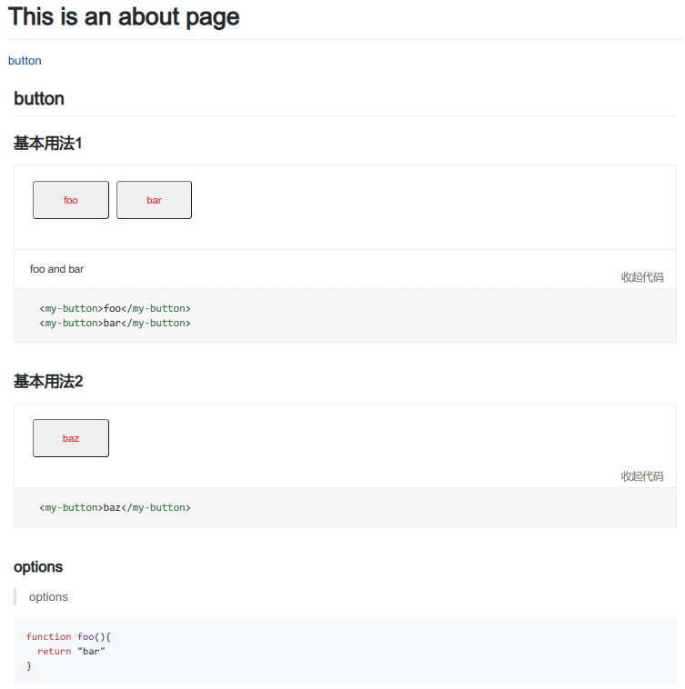

# 02 enhance markdown loader

Now it's time to enhance our markdown loader. Before writing code, we should clarify the ideas for code realization.

## ideas

### input format

our input markdown file format example:
```
<style>
.my-button {
  margin: 0 10px 10px 0;
}
</style>

<script>
console.log("button docs");
</script>

## button

### 基本用法1

:::demo foo and bar
\\```html 
<my-button>foo</my-button>
<my-button>bar</my-button>
\\```
:::

### 基本用法2

:::demo
\\```html 
<my-button>baz</my-button>
\\```
:::

### options

> options

```
let's divide above markdown into three categories:
- top part: css style and js script
- normal markdown content: such as `## button` title
- `demo` block in between two `:::`
### our goal
- extract top part's `style` and `script` into vue SFC corresponding `style` and `script`
- parse `demo` block, replace it's content by external vue component `DemoBlock`(should be registered globally).
- parse normal markdown content and copy to vue SFC `template`. 

After 3 steps above, we now get a normal vue SFC file in
  memory. Pass this vue file to vue-loader v16.5.0, then you can get final compiled result as html.
## implementation

Here I will not explain the code line by line. But I will explain the key code snippet.

### extract top part's `style` and `script`

`scripts/mad-vue-markdown-loader/index.js`
```js
  // extract style and script(first), then remove style and script
const output = {
  style: $.html("style"),
  // get only the first script child. Causes issues if multiple script files in page.
  script: $.html($("script").first())
};
$("style").remove();
$("script").remove();

let result;

// $.html() means all html code
result =
  `<template><${wrapper}>` +
  $.html() +
  `</${wrapper}></template>\n` +
  output.style +
  "\n" +
  output.script;

return result;
```
### parse `demo` block

`vue.config.js`
```js
render: function(tokens, idx) {
  // open tags
  if (tokens[idx].nesting === 1) {
    // 1.获取第一行的内容使用markdown渲染html作为组件的描述
    // (.*) is description text group = demoInfo[1]
    let demoInfo = tokens[idx].info.trim().match(/^demo\s+(.*)$/);
    let description =
      demoInfo && demoInfo.length > 1 ? demoInfo[1] : "";
    let descriptionHTML = description ? markdownRender.render(description) : "";

    // 2.获取代码块内的html和js代码
    let content = tokens[idx + 1].content;

    // 3.使用自定义开发组件【DemoBlock】来包裹内容
    // 然后程序继续render fence，按照fence规则渲染出代码放入v-slot:highlight，作为隐藏的查看代码。
    return `<demo-block>
                                <template v-slot:source>
                                    <div class="source">${content}</div>
                                </template>
                                
                                ${descriptionHTML}
                                
                                <template v-slot:highlight>
                                  <div class="highlight">
                                  <!--这里就是显示代码片段的地方-->                            
                            `;
  } else {
    // close tags must put here
    return "</template></div></demo-block>\n";
  }
}
```
### parse normal markdown content and copy

`scripts/mad-vue-markdown-loader/index.js`
```js
 // @符号在markdown中是特殊符号, 改为 __at__ ,然后渲染该md文件，这样不会冲突
source = source.replace(/@/g, "__at__");
// 渲染完md之后，就把@符号恢复
const content = parser.render(source).replace(/__at__/g, "@");

const result = renderVueTemplate(content, opts.wrapper);

if (opts.raw) {
  return result;
} else {
  return "module.exports = " + JSON.stringify(result);
}
```
### pass markdown loader result to vue-loader

`vue.config.js`
```js
chainWebpack: (config) => {
  config.module
    .rule("md")
    .test(/\.md$/)
    // refer issue https://github.com/vuejs/vue-loader/issues/1883
    // fix broken: use v16.5.0
    .use("vue-loader")
    .loader("vue-loader")
    .end()
    .use("mad-vue-markdown-loader")
    .loader("./scripts/mad-vue-markdown-loader/index.js")
```
Note: loader execute order is reversed.

## next

### write DemoBlock.vue

key code snippet as below:
```html
<template>
  <div class="demo-block">
    <div class="demo-block-source">
      <slot name="source"></slot>
      ...
    </div>

    <div class="demo-block-meta" v-if="$slots.default">
      <slot></slot>
      ...
    </div>

    <div class="demo-block-code" v-show="showCode">
      <slot name="highlight"></slot>
    </div>
  </div>
</template>
```

### hardcode one route in vue-router
```js
  {
    path: "/about",
    name: "About",
    component: () => import("../views/About.vue"),
    children: [
      {
        path: "button",
        component: () => import(`@/docs/${"button"}.md`)
      }
    ]
  }
```

### edit About.vue
```vue
<template>
  <div class="about">
    <h1>This is an about page</h1>
    <router-link to="/about/button">button</router-link>
    <router-view />
  </div>
</template>

<script>
export default {};
</script>
```
Now Let's run app by `npm run serve`. Visit `http://localhost:8080/about/button`
If it works, you should see:



## summary

In this chapter, we enhance our markdown loader successfully. It can :
- extract style and script from *.md file into vue SFC
- find `demo` block and parse it as vue SFC template
- parse normal markdown content and merge into vue SFC template

Next step, we can design our docs' website layout and stylize it.
