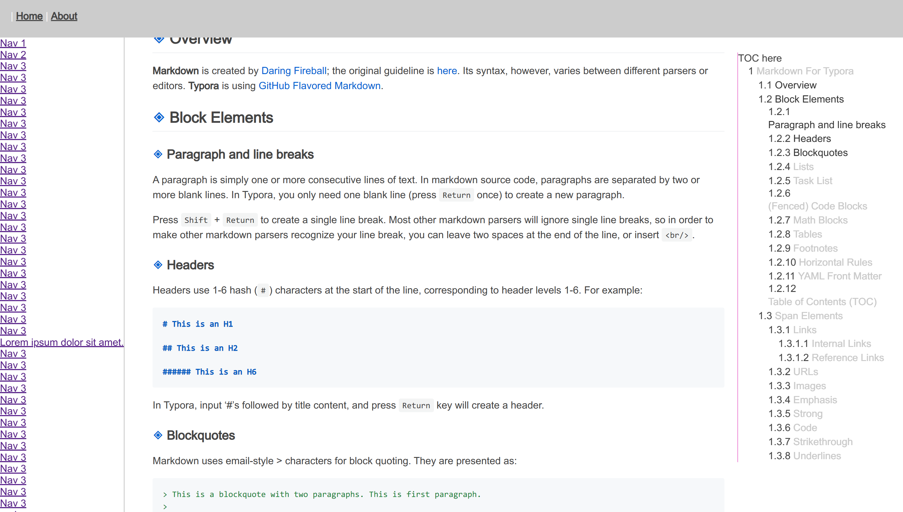
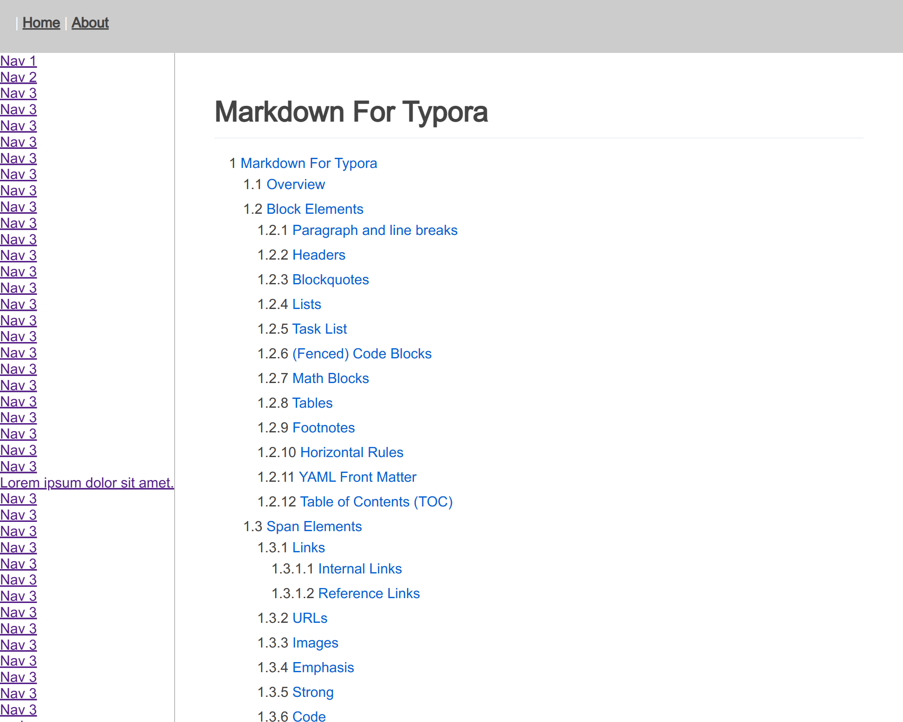

# 04 design website layout

## our goal

- A fixed header.
  > position: fixed
- A sticky, flexible-width sidebar.
  > gird template column: max-content + position: sticky
- A flexible main content container (that changes width based on the content of
  the sidebar)
  > gird template column: 1fr
- The sidebar and main content container scroll independently.
  > make container div: overflow-y: scroll;
- Sticky aside for TOC of one page
  > position: sticky
- When scroll y, sync toc to highlight current active item
  > use IntersectionObserver to check visible section, then add `active` css class to style item

## base css

```css
* {
  margin: 0;
  padding: 0;
  box-sizing: border-box;
}

ul li {
  list-style: none;
}

html, body {
  font-family: Avenir, Helvetica, Arial, sans-serif;
  -webkit-font-smoothing: antialiased;
  -moz-osx-font-smoothing: grayscale;
  color: #444444;
  width: 100%;
  height: 100%;
  scroll-behavior: smooth;
}
```

Note:

- `*` section is poor reset but simple
- remove ul and li list-style
- html and body set 100% width and height

## cleanup App.vue

``` vue
<template>
  <div id="app">
    <router-view />
  </div>
</template>

<script></script>

<style lang="scss">
// https://github.com/sindresorhus/github-markdown-css
@import "~github-markdown-css";
// https://github.com/highlightjs/highlight.js/#es6-modules--import
@import "~highlight.js/styles/github.css";

@import "styles/base";

#app {
  font-family: Avenir, Helvetica, Arial, sans-serif;
  -webkit-font-smoothing: antialiased;
  -moz-osx-font-smoothing: grayscale;
  color: #444444;
}
</style>
```

- remove all `template`'s inner code, then put vue `router-view` entry
- import github-markdown-css to render markdown like GFM style
- import highlight.js github.css to highlight code snippet like github
- remove other css code

## refactor router code

change `About` to more semantic word: `Component`

``` js
{
  path: "/component",
  name: "Component",
  component: () => import("@/views/Component.vue"),
  children: [
    {
      path: "button",
      component: () => import(`@/docs/${"button"}.md`)
    },
    {
      path: "test",
      component: () => import(`@/docs/${"test"}.md`)
    }
  ]
}
```

Now, create one vue SFC file named `Component.vue`

## design page layout


Note:

- two viewports: 1200px and 999px
- 3 cases: <=999px , 1000-1200px, > 1200px

Now, we can implement this layout step by step.

### template

``` html
<template>
  <div class="component-page">

    <header class="header">
      <a class="toggle" id="toggle">☰</a>|
      <router-link to="/">Home</router-link>
      |
      <router-link to="/about">About</router-link>
    </header>

    <main class="main">
      <nav class="nav">
        <ul>
          <li><a href="">Nav 1</a></li>
          <li><a href="">Nav 2</a></li>
          <li><a href="">Nav 3</a></li>
          ...
        </ul>
      </nav>
      <article class="markdown-body">
        <router-view />
      </article>
      <aside class="toc"></aside>
    </main>

  </div>
</template>
```

### style

> only show key css code

header:

``` scss
.header {
  position: fixed;
  display: block;
  width: 100%;
  height: 60px;
  z-index: 9; // increase z-index

  .toggle {
    display: none;
  }
}
```

main

```scss
.main {
  display: grid;
  grid-template-columns: max-content 1fr 15em;
  width: 100%;
  position: relative;
  padding-top: 60px; // padding top by header's height
}
```

nav

```scss
.nav {
  position: sticky;
  top: 60px;
  align-self: start;
  height: calc(100vh - 60px);
  overflow-y: scroll; //make it can y scroll
}
```

markdown-body

```scss
.markdown-body {
  box-sizing: border-box;
  width: 100%;
  min-width: 200px;
  max-width: 980px;
  margin: 0 auto; // horizontal center
  padding: 24px 45px;
}
```

.toc(aside)

```scss
.toc {
  position: sticky;
  align-self: start;
  margin-top: 24px;
  top: 84px; /*84 =60(header height) + 24 (margin-top)*/
  max-height: 80vh;
  overflow-y: auto;
}
```

Media query code

```scss
@media screen and (max-width: 1200px) {
  .toc {
    display: none;
  }
  .main {
    grid-template-columns: max-content 1fr 0; //use 0 to release .toc space
  }
}

@media screen and (max-width: 999px) {
  .header {
    .toggle {
      display: inline-block; //show toggle icon
    }
  }
  .main {
    grid-template-columns: 0 1fr 0; // first 0 to release .nav space
  }
}
```

### stop, let's check layout

large screen


middle screen


small screen


Now, we haven't written any script so our toggle icon has no function when
clicked.

### script

> For whole code, please check `Component.vue`

only show key pseudocode.
``` vue
<script>
  export default {
    name: "Component",
    data() {
      return {
        asideObserver: null
      };
    },
    mounted() {
      this.copyMarkdownTocToAside();
      this.syncAsideWhenScroll();
      this.setupToggleMenu();
      this.setupMediaQuery();
    },
    beforeUnmount() {
      this.stopObserveAside();
    },
    methods:{
      //...omit
    }
  };
</script>
```
- copyMarkdownTocToAside(): select DOM and append to other DOM.
- syncAsideWhenScroll(): use `IntersectionObserver()` API.
- setupToggleMenu(): `addEventListener()` for user click action.
- setupMediaQuery(): use `window.matchMedia()` API
- stopObserveAside(): use `observer.unobserve()` API
