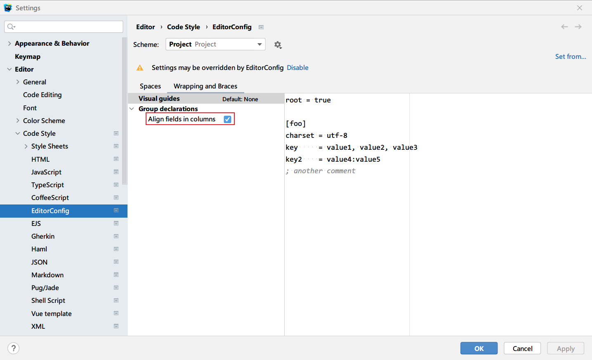
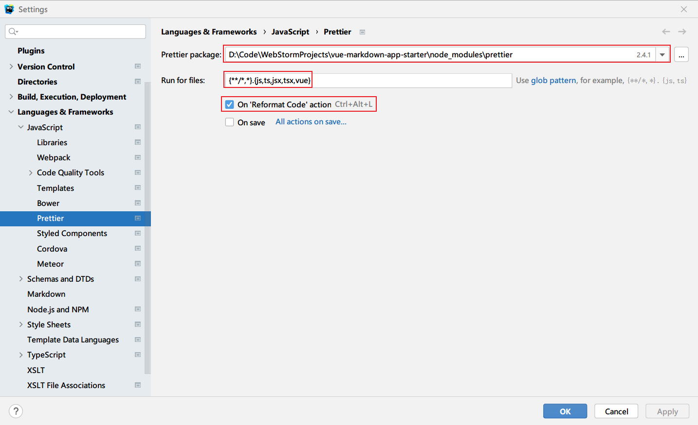
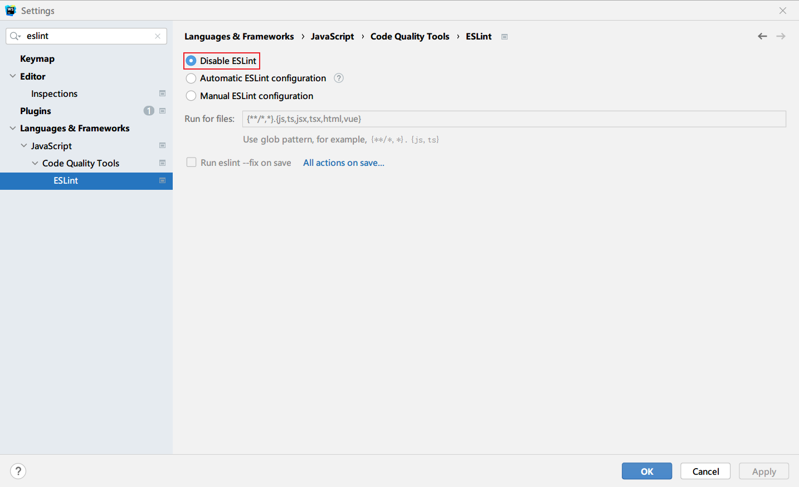

# Format code setting in Webstorm

## overview

- setup editorconfig
- setup prettier
- setup eslint

## setup editorconfig

> Settings > Editor > Code Style > editor config



- [x] Align fields in columns

```
root = true

[*]
charset                  = utf-8
indent_style             = space
indent_size              = 2
end_of_line              = lf
insert_final_newline     = true
tab_width                = 2
trim_trailing_whitespace = true
max_line_length          = 80
```

## setup prettier

> Languages & frameworks -> JavaScript -> Prettier



1. select prettier package path
2. add `.vue` postfix to `Run for file`
3. enable `ON 'Reformat Code' Action`

```js
// prettier.config.js or .prettierrc.js
module.exports = {
  trailingComma: "none",
  tabWidth: 2,
  printWidth: 80,
  endOfLine: "auto",
  semi: true,
  singleQuote: false,
  arrowParens: "always"
};
```

## setup eslint

In order to make webstorm not conflicts with npm script `npm run lint`, here i
disable eslint configuration in webstorm.



