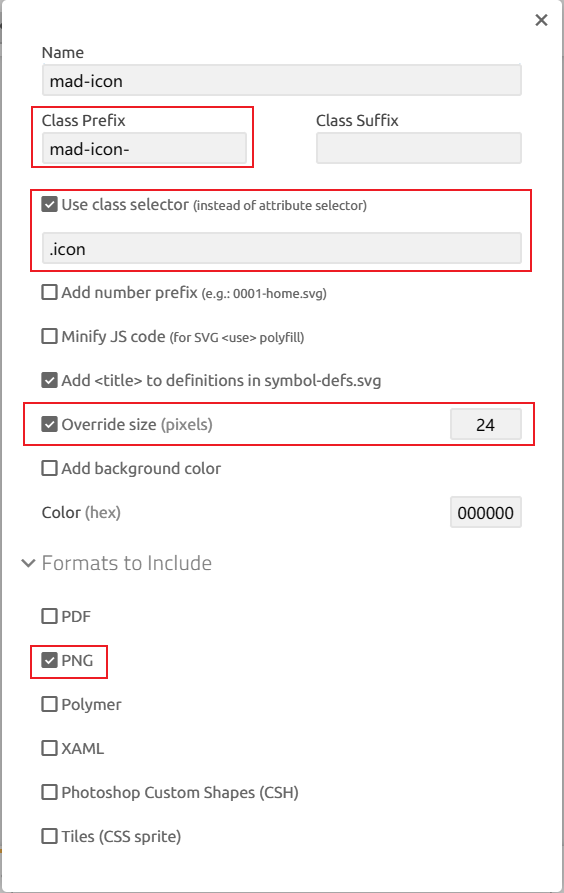

# icomoon 使用指南

本文为 [icomoon app](https://icomoon.io/app/) 的使用指南。内容涵盖如下:

1. 项目的整体信息配置
2. 选择处理图标
- 功能介绍-顶部菜单栏
- 功能介绍-左侧Menu选项列表
- 功能介绍-特定图标Set的配置
- 从在线图标库中获取更多图标
3. 导出图标

## 项目的整体信息配置

- 定义CSS class前缀为 `mad-icon`
- 使用class选择器 `.icon` 表示图标
- 重写size大小为24x24
- 最终导出的格式包含PNG

## 选择处理图标

### 功能介绍-顶部菜单栏

- 选择：选择某一个图标
- 删除：激活删除之后，点击特定图标，该图标就会被删除。
- 移动：激活移动之后。鼠标点击并拖动特定图标，可以移动该图标在集合中的排列位置。
- 编辑：激活编辑之后。鼠标点击特定图标，就可以进入编辑面板。

由于编辑面板功能很多，下面具体介绍。

- 启用网格参考线。下面是16x16的格子参考线。格子数量可以自定义。

- 旋转和镜像。

这个功能适合用来快速制作箭头图标的变体。例如左箭头分别旋转90度，就能得到其他箭头。

- 移动图标位置。图中演示了向左移动。

- 缩放。图中演示了适应画布大小，刚好匹配画布容器。

- 对齐。图中演示了增加画布大小，可以看到右侧出现较多空白区域。

- 着色。用于初始着色。这个功能不常用，因为colorize这个功能留给代码层实现。

### 功能介绍-左侧Menu选项列表

常用功能项：
- 新建空set
- 从已选图标选区创建新的set
- 清除当前已选选区

### 功能介绍-特定图标Set的配置

其中，下载JSON这个功能值得注意。它保存了可以重建该图标集合的充分信息。

json文件包含了path的信息，足够重建图标。

### 从在线图标库中获取更多图标
点击顶部菜单栏的【图标库】按钮。进入在线图标库页面。
- feather icons
- icomoon free
